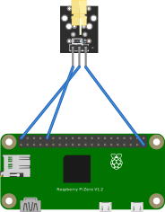

# KY-008 Laser module


S: Signal線
-: GNG
真ん中: 5V

SignalとGNDをつないで5Vを使わなくても使えるらしい。

Parameter | Value
--- | ---
Supply Voltage | 5 Vdc
Current | 30 mA
Wavelength | 650 nm
Color | Red

Sample Raspi Python code

```
#!/usr/bin/env python
import RPi.GPIO as GPIO
import time

LedPin = 10    # 物理10Pin

def setup():
	GPIO.setmode(GPIO.BOARD) # 物理Pinに割り当て
	GPIO.setup(LedPin, GPIO.OUT) # 物理10Pinをoutputに割り当て
	GPIO.output(LedPin, GPIO.HIGH) # On

def loop():
	while True:
		print('...On')
		GPIO.output(LedPin, GPIO.HIGH) 
		time.sleep(1)
		print('Off')
		GPIO.output(LedPin, GPIO.LOW) # Off
		time.sleep(1)

def destroy():
	GPIO.output(LedPin, GPIO.LOW)
	GPIO.cleanup() # Resourceをcleanup

if __name__ == '__main__':
	setup()
	try:
		loop()
	except KeyboardInterrupt:
		destroy()

```

Frizing




動作確認


