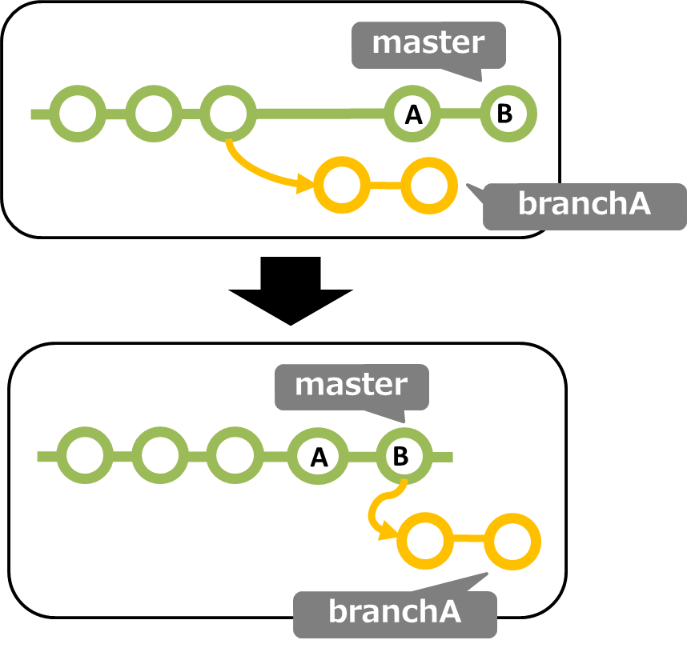

# Command TIPS

## 目次

[[toc]]


多くの現場でGitは共通言語で語られがちで、当たり前にできないといけない。

できないとペアプロで怒鳴られたり、雰囲気を悪くするのでよく使うやつをメモっとく。

利用ケースは茶番。実際にはこんな怒られ方はしない。

## 変更log

### 全ブランチをNetworkでそれっぽく出す

利用用途: 今自分がどこにいるのか、どこにマージされるのか見る

```
git log --graph --oneline --decorate --all
```

### logとともにファイルの変更差分も出す

```
git whatchanged -p
```

### 特定のファイルのコミット履歴

```
git log -- hoge.json
```

#### 変更差分も見たい時

```
git log -p -- hoge.json
```

### コミットが属しているブランチ一覧

```
git branch --contains [コミットハッシュ]
```

## add

### 間違えてgit addしてしまった！

利用ケース:

ワイ「寝不足やわ…。ぽちっと…。　あ！あかん、へんなファイルaddしてもうた。コミットしてからgit rm は恥ずかしいわぁ。」

```
git reset HEAD [ファイル名]
```

*ファイル名がない場合はstageされたファイルすべてがunstageになるのでもういちどaddしような！*

### コミットコメントを修正したい

A「なんやねんこのクソコメント…。なにがfix codeじゃい。んなもんわかるわ。ちゃんと書けい！書かんとどうなるかわかとんのかアァーン！？」

ワイ「やべぇよやべぇよ」

#### 直前のコミットの場合

```
git commit --amend -m "fix message"
```

#### それ以外のコミットの場合

```
# ~ の数だけ、過去分をさかのぼる
git rebase -i HEAD^~~~

# もしくは特定のコミットだけ変更する場合
git rebase -i コミットハッシュ
```

と入力すると、さかのぼった分だけのコミットが表示され・・

```
pick a21a813bc commitメッセージ
pick d821e1bca commitメッセージ

# Rebase XXXXX..XXXXX onto XXXXXX
#
# Commands:
#  p, pick = use commit
#  r, reword = use commit, but edit the commit message
#  e, edit = use commit, but stop for amending
#  s, squash = use commit, but meld into previous commit
#  f, fixup = like "squash", but discard this commit's log message
#  x, exec = run command (the rest of the line) using shell
#
# If you remove a line here THAT COMMIT WILL BE LOST.
# However, if you remove everything, the rebase will be aborted.
#
```

エディタで書き換えてあげて保存する

pick => そのまま
reword => コミットメッセージを変えたいやーつ

rewordにしたやつがその次

```
hogeee

# Please enter the commit message for your changes. Lines starting
# with '#' will be ignored, and an empty message aborts the commit.
#
# Date:      Wed Oct 30 00:38:19 2019 +0900
#
# interactive rebase in progress; onto 44c7d4b
# Last commands done (2 commands done):
#    pick 21b1144 logo

```

コミットメッセージの変更画面に遷移する

### バージョン管理されていないファイルを削除

```
# 確認
git clean -n
# 削除
git clean -f 
```

## commit

### 他のブランチのファイルの変更を取り込む

```
git checkout <ブランチ名> -- <対象ファイルのパス>
```

### まちがってコミットしてしまった！！

結構あるある。

利用ケース:

ワイ「よし、コミットや。しもた！3の時アホになるロジックバグったままやった！直さな。ん？でもアホなんだから直さなくてもええんとちがいます？」

#### コミットしたファイルは消したくないなぁ・・・

```
git reset --soft HEAD^
```

indexも解除していい場合は

```
git reset --mixed HEAD^ 
```

##### ファイル単体の場合

ファイル単体なら`git rm`のほうが楽

ただしdeleteのコミットは残るので注意

`--cached`すればファイルは消えない（deleteのstageにはなる）

```
git rm --cached ファイル名
git commit -m "消したよ"
```

#### コミットしたファイルは消していいゾ

```
git reset --hard HEAD^
```

自分しか見てないブランチならforce pushもやぶさかではない。

##### ファイル単体の場合

ファイル単体なら`git rm`のほうが楽

ただしdeleteのコミットは残るので注意

```
git rm ファイル名
git commit -m "消したよ"
```


### 切り戻しのコミット技

みんなが作業しているブランチへのpushや、意図して取り消したい変更履歴を残したい場合

特定のコミットの打消しコミットを作る `revert` が便利。

ただし、マージコミットの打消しなどちょっとトリッキーな部分もあるので覚えておくとgit大臣になれそう。

#### 特定コミットの打消し

打消しのコミットができる

```
git revert コミットハッシュ
```

#### コミットはしたくない

コミットは生成されずindexに打消しの変更を残す

使う場面は例えば特定のコミットでバグが混入したので、そいつを手で修正しながら別のところも修正…、みたいな時にrevertでコミットを打たずにできあがったタイミングでそれとなくコミットをうつ。

利用ケース:

A「しもた！ワイのここのコミットがあかんかったねんな。tuboneくん今同じソース触ってるからついでに打ち消してくれへんか？　せっかくだけん、ソースにコメントも残してけーや。」

ワイ「git revertですね。あ、でも打ち消しのコミットとコメント書くコミット二つになってしまうなぁ。どないしよう。」

```
git revert コミットハッシュ -n
```

#### マージコミットを打ち消す

利用ケース: 

A「リリースするためにmasterにPRマージするやで」

～30分後～

A「動かんぞ！早く切り戻せ。masterをリリース前に戻せや。一応作業ログ残したいから `revert` で頼むやで」

ワイ「なんや複雑やけど、revertかな？　んん？ふつうにやってもエラーになってまう。どないしたらええんや！」

##### 一般的に

```
git revert -m 1 マージコミットハッシュ
```

でよい

###### 解説

`-m` オプションは main-line という意味で本線と訳されます。

マージコミットの場合、2つのブランチが合体するので、打消しコミットをどっちにつければいいか指定するオプションがあります。

1のときは「マージされた側のブランチ」、2のときは「マージする側のブランチ」です。

原則revertは打ち消したいコミットのいるbranchで打つといいかも～なので基本は 1 でいいわけです。

## delete

### ローカルブランチに残っている古いリモートブランチをけす

PRが無事マージされたので残ったローカルブランチをきれいにしたいとき重宝

利用ケース:

ワイ「ローカルにえらいたくさんのブランチが残っとるな。掃除するか」

#### ドライラン

```
git remote prune --dry-run origin
```

#### 消す

```
git remote prune origin
```

もしくは

```
git fetch -p
```

## stash

コメント、リストなど色々な機能があるけど、きちんと管理したいならブランチ切れやといわれるので基本これだけ

利用ケース:

B「PR見てくださいー！！　すぐみれや！！」

ワイ「くっそ、やりかけの作業があるんや！待っとって、と言えたらいいのに…」

### とりま退避

```
git stash
```

### 戻す

```
git pop
```

## 付け替え



### 別ブランチからはやし直す

利用ケース: 

切り元のブランチがPRマージされて進んだときに、

A「master進んだんで生やしなおしてね」

ワイ「なんやねん、生やしなおすって。ええや、構わずPRぽちーっと」

A「あほんだら！ポンコツブタやろう（tuboneの蔑称）のせいでわけわからんnetworkになったやろがい。」

#### パターン1

```
git checkout branchA
git rebase master
```

#### パターン2

ontoってのを使うと好きなように生やせる。

上記のパワハラ会話ではパターン1でよいが、特定コミットからhotfixを切り戻すときなど重宝

```
git rebase --onto master branchAの中で生やしたい位置のコミットハッシュ branchA
```

#### もしすでにブランチをpushしていたら・・

他の人のツリーにも影響を与えてしまうので、pushするまえに

「ブランチ最新のmasterから生やしなおしました～」というとかっこいいゾ！

```
git push -f origin branchA
```

#### もしコンフリクトしたら・・

コンフリクトしたら直すしかない。

```
git status

On branch b_branch
You have unmerged paths.
  (fix conflicts and run "git commit")
  (use "git rebase --abort" to abort the merge)

Changes to be committed:

        new file:   fuel/app/classes/util/ahoge.php

Unmerged paths:
  (use "git add <file>..." to mark resolution)

        both added:      fuel/app/classes/util/message.php #コンフリクトしているやーつ
```

`<<<<<<< HEAD` でファイル内検索し、コンフリクトを直す

```
git add fuel/app/classes/util/message.php
git rebase --continue
```


### 特定コミットハッシュをブランチのHEADにしちゃう

通常タグを使うべきところだが、一部の現場ではブランチにリリースバージョンを振って保存するケースもある。

そんなときに使える小技

利用ケース:

A「ポンコツブタやろう（tuboneの蔑称）。あれほどリリースしたらバージョンのブランチ切れっていったよなあぁん！？　master進んでしもてるねんけどどないしてくれるん？」

ワイ「エンコ（小指のこと）詰めます。」

```
git branch --create-reflog ブランチ名 コミットハッシュ
```

## リモートブランチをforce pushした時の小技

リモートブランチと同期してローカルの変更を上書きするワンライナーです。

あるあるなシチュエーションはrebaseしてforce pushしたのち、別の環境でそれをローカルに取り込むときです。

```
git fetch origin && git reset --hard origin/branchname && git clean -f -d
```

## 1ファイルだけ別のブランチから持ってくる

誰かが別ブランチで作った特定のファイルだけ自分のブランチに取り込む場合

```
git checkout <ブランチ名> -- <ファイル名>

or 

git checkout <ブランチ名> -- <ディレクトリ名>
```

必要に応じて、commitを打てばよい。

## コミットをまとめる

コミットをまとめて本線に対してrevertしてpush、PRを作るのは常識だったりするので、やらないと怖い人がくることがある。

良い子はPRするときはちゃんとコミットをまとめておこう！

まとめたいコミットの数をrebaseで指定

```
git rebase -i HEAD~4
```

-i をつけることでeditorが出てくる

```
  1 pick 7752471 Update README.md¬
  2 pick 7b3b13a Update README.md¬
  3 ¬
  4 # Rebase 7f7aaa2..7b3b13a onto 7f7aaa2 (2 commands)¬
  5 #¬
  6 # Commands:¬
  7 # p, pick <commit> = use commit¬
  8 # r, reword <commit> = use commit, but edit the commit message¬
  9 # e, edit <commit> = use commit, but stop for amending¬
 10 # s, squash <commit> = use commit, but meld into previous commit¬
 11 # f, fixup <commit> = like "squash", but discard this commit's log message¬
 12 # x, exec <command> = run command (the rest of the line) using shell¬
 13 # b, break = stop here (continue rebase later with 'git rebase --continue')¬
 14 # d, drop <commit> = remove commit¬
 15 # l, label <label> = label current HEAD with a name¬
 16 # t, reset <label> = reset HEAD to a label¬
 17 # m, merge [-C <commit> | -c <commit>] <label> [# <oneline>]¬
 18 # .       create a merge commit using the original merge commit's¬
 19 # .       message (or the oneline, if no original merge commit was¬
 20 # .       specified). Use -c <commit> to reword the commit message.¬
 21 #¬
 22 # These lines can be re-ordered; they are executed from top to bottom.¬
 23 #¬
 24 # If you remove a line here THAT COMMIT WILL BE LOST.¬
 25 #¬
 26 # However, if you remove everything, the rebase will be aborted.¬
```

まとめたいコミットを `pick` => `squash` または `s`に変更する

## タグの運用

バージョン管理はgit tagを使うと幸せになる。

なぜなら、リリースドラフトがGitHubで書けるから。

### タグを打つ

```
git tag -a v1.0.x -m "なんかコメントあれば"
git push origin v1.0.x
```

### タグを消す

```
git tag -d v1.0.x
git push origin :v1.0.x
```

### タグ一覧表示

```
git tag -n 
```

### タグからブランチを作成

```
git checkout -b ブランチ名 タグ名
```

## 差分を確認したい

### ブランチ同士を比較したい

#### 元ブランチ(master)からどんな変更が加わったか見る

利用ケース:

ワイ「ワイのブランチどれくらい進んでるんかな？　おっ！めっちゃ差分や！今宵の酒もうまくなるぞーー」

```
git log master..branch1
```

#### 差分のあるファイルだけ列挙

```
git diff --name-only 
```

#### コミット同士の比較

GitHubで便利なアレ

```
git diff コミットハッシュ コミットハッシュ
```

## WIP系

### 空コミットを打つ

WIPでPR出してから作業する人向け。
first commitするまでWIP PRが作れないので空コミットを打つ運用。

```
git commit --allow-empty
```

参考: [git commit --allow-empty を使った WIP PR ワークフロー](https://qiita.com/a-suenami/items/129e09f8550f31e4c2da)

## つまみ食い

### 童貞コマンド cherry-pick

例えばAさんが作っているfeature branchから一部の共通処理部分のコミットを拝借したいとき、

つまみ食い機能、もとい童貞機能がある

利用ケース:

B「便利なtime util作りましたー。ポンコツブタやろう（tuboneの蔑称）も使えや！」

ワイ「さんきゅーな！でもどないしてとりこもう。ファイルコピペー、じゃスマートやないしなぁ。」

git logの結果

```
commit 213dd32
    main修正
    
commit 173vdd20
    main修正2
    
commit 6742aa0b
    便利なtime_util作りました　　<= こいつだけが欲しい！
    
commit aa12301b
    便利なtime_util作りました2
    
commit ca16709d
    便利なtime_util作りました3
```

となってるときに、6742aa0bだけとりこみたい。

```
# 自分のブランチで
git cherry-pick 6742aa0b
```

コミットまとめてcherry-pickも可能だが99.9%コンフリクトする

一個ずつやるか、まとめられるなら、git rebase -i でまとめてからやったほうがいい。

6742aa0bからca16709dまでとりこみたい。

```
# 便利なtime_util作りました3までほしい

git cherry-pick 6742aa0b..ca16709d
```

## Gitの操作ログがみたい

```
git reflog
```

## 特定レポジトリで別名Git config使いたい

```
git config --local user.name "サブアカウント"
git config --local user.email "サブアカウントメールアドレス"
```

## 小技

### 前にいたブランチに素早く移動する

```
git checkout -
```

### masterにマージ済みのブランチを表示する

```
git branch --merged master
```

### 全てのコンフリクトしているファイルを表示する

```
git diff --name-only --diff-filter=U
```

### masterにマージ済みのブランチを削除する

```
git branch --merged master | grep -v '^\*' | xargs -n 1 git branch -d
```

### より安全なforce push

誰かの作業を上書きしない場合、リモートに強制的にpushする

```
git push --force-with-lease <remote-name> <branch-name>
```

### コントリビューターを一覧にしたい

```
git log --all | grep 'Author' | sort -u
```

### git pullできないのでファイルを戻す

```
git restore ファイル名
```


